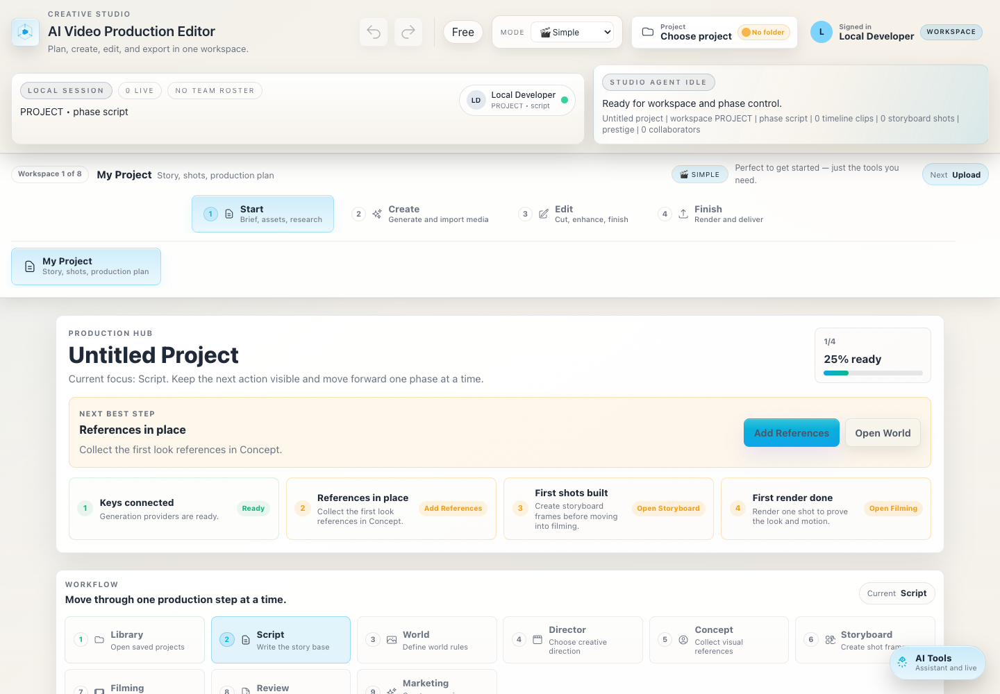

# AI Video Production Editor

Open-source, local-first AI film production workspace for moving from script to
director treatment, storyboard, AI filming, continuity review, editing, and
export.

<p align="center">
  <a href="https://youtu.be/-6jo636vRSw?si=v5XSwSIz4WfLtE9z">
    
  </a>
  <br />
  <strong><a href="https://youtu.be/-6jo636vRSw?si=v5XSwSIz4WfLtE9z">Watch the launch trailer</a></strong>
</p>

<p align="center">
  <a href="https://github.com/LudwigKienle/ai-video-production-editor/releases/latest">
    
  </a>
  <a href="https://github.com/LudwigKienle/ai-video-production-editor/archive/refs/heads/main.zip">
    
  </a>
  <br />
  <strong>Get the newest official desktop build or download the source code.</strong>
  <br />
  <sub>End users download the signed/notarized macOS DMG or Windows EXE. Developers can download the full source as ZIP.</sub>
</p>

<p align="center">
  <a href="https://github.com/LudwigKienle/ai-video-production-editor/stargazers"></a>
  <a href="https://github.com/LudwigKienle/ai-video-production-editor/fork"></a>
  <a href="https://github.com/LudwigKienle/ai-video-production-editor/issues"></a>
  <a href="LICENSE"></a>
  <a href="https://github.com/LudwigKienle/ai-video-production-editor/releases/latest"></a>
</p>

AI Video Production Editor is built around the idea that AI video production
should feel like a real creative workstation, not a locked hosted form. Bring
your own API keys, keep projects local, route work across model providers,
inspect the pipeline, and extend the app with new adapters.

If this project is useful, please star the repository. Stars help other
filmmakers, AI artists, and developers find the project.



## 30-second tour

```text
Script -> Director pass -> Concepts -> Storyboard -> AI filming
       -> Continuity review -> Re-film queue -> Timeline/edit -> Export
```

The public source includes the production surfaces behind that flow: Project
Hub, Director treatment, Scene Wall, Studio Agent tasks, Node Space, media
generation workspaces, Gemini continuity review, review tasks, timeline tools,
and export/handoff utilities.

- [Capability map](docs/CAPABILITY_MAP.md): code-level overview of what is in
  the app today.
- [First 10 minutes](docs/FIRST_10_MINUTES.md): fastest path from clone to
  understanding the production loop.
- [Demo project walkthrough](examples/demo-project/README.md): a small
  script-to-filming example contributors can use without private media.
- [Contributor paths](docs/CONTRIBUTOR_PATHS.md): where to start based on your
  skills.
- [Open-source launch notes](docs/releases/v0.1.0-open-source-launch.md):
  release copy for GitHub, LinkedIn, Hacker News, Reddit, and launch pages.

## Why star or fork it?

- Full React + Electron source code, not just installer downloads.
- Local-first desktop workflows for AI film production and creative iteration.
- Script-to-filming workflow with Director pass, storyboard, filming, review,
  and export surfaces.
- Node-based pipelines for model routing, prompt chains, media processing, and
  output handoff.
- Continuity review and re-film queue concepts for making generated shots more
  production-aware.
- Bring-your-own-key integrations for fast-moving AI providers.
- GPL-3.0-or-later open-source core that contributors can inspect, fork, and
  improve.
- Practical project surface for filmmakers, AI artists, creative coders, and
  developers who want to build new production tools together.

## Why this exists

Most AI video tools hide the production process behind a paywall or a single
provider. AI Video Production Editor is meant to become an open desktop studio
for creators and developers who want transparent workflows, local project
ownership, and fast support for new generation models.

The long-term direction is Blender-inspired: a free and open desktop core,
community-extensible workflows, and optional paid hosted services for teams,
credits, cloud rendering, support, and convenience.

## What it can do

| Area | Included |
| --- | --- |
| Desktop app | Electron studio with browser preview support |
| Script-to-filming | Project Hub, script, Director pass, Director treatment, storyboard, filming, review, and export |
| AI continuity | Gemini continuity review, drift scoring, continuity prompt refinement, and re-film queue concepts |
| AI generation | Image, video, audio, prompt, reference, and provider routing workflows |
| Node workflows | Node Space for graph-style creative pipelines and production chains |
| Film planning | Story bible, worldbuilding, Scene Wall, set design, moodboards, and production references |
| Editing | Timeline, grading, effects, audio, export, OpenTimelineIO/FCPXML-style handoff utilities |
| Providers | Gemini, FAL, Replicate, xAI, ElevenLabs, Sonauto, Brave Search, Supabase, Stripe, and related integrations |
| Models | GPT Image, Nano Banana, Seedance, Kling, Happy Horse, Veo, WAN, LTX, Grok, Seedream, Qwen, Flux, and related adapters |
| Extensibility | Provider services, workspace components, SDK package, hosted BYOK/proxy APIs |

## Status

This repository is in an open-source transition. The desktop app runs locally,
but some provider integrations require external API keys, and some hosted
features require Supabase/Stripe configuration. APIs in the AI video ecosystem
change quickly; model adapters should be treated as maintained integration
points rather than permanent contracts.

See the [UI production workflow guide](docs/ui-production-workflow-guide.md)
for annotated studio screenshots and the full path from script to filming,
editing, and export.

For launch copy, GitHub social preview, and LinkedIn-ready assets, see the
[launch kit](docs/marketing/launch-kit.md).

For a concise technical feature overview, see the
[capability map](docs/CAPABILITY_MAP.md).

More launch screenshots should live in `docs/assets/screenshots/` or
`docs/assets/ui-guide/` so the README stays useful without committing generated
release builds or private project media.

## Video Tutorials

Official channel: [youtube.com/@AIVideoProductionEditor](https://www.youtube.com/@AIVideoProductionEditor)

Recommended support path:

- Start with the short product overview if you want the fastest first
  impression.
- Watch the full Mac walkthrough for API keys, script writing, storyboards,
  video generation, editing, grading, and export.
- Watch the v1.5 launch tour for AI Director, Node Graph, Sound tab, and 3D set
  design.
- Watch the v2.5 update for the newest release direction, Scene Wall, and
  YouTube-oriented workflow tips.

## Quick start

If you only want to use the desktop app, download the newest installer from
[GitHub Releases](https://github.com/LudwigKienle/ai-video-production-editor/releases/latest):

- macOS: signed and notarized `.dmg`
- Windows: `.exe` installer

The build instructions below are for developers and contributors.

Prerequisites:

- Node.js 20.19 or newer, or Node.js 22.12 or newer
- npm
- Optional provider API keys for the models you want to use
- Python 3 for optional local audio mastering/remastering tools

Install dependencies:

```bash
npm install
```

Create local environment overrides:

```bash
cp .env.example .env.local
```

Run the browser studio:

```bash
npm run dev
```

Run the Electron app:

```bash
npm run electron:dev
```

Build the web app:

```bash
npm run build:web
```

Build distributable desktop packages:

```bash
npm run electron:build
```

Run public-release checks before changing repository visibility:

```bash
npm test
npm run check:public-release
npm run check:public-release:strict
npm audit --audit-level=low
```

Generated output lives in `dist`, `dist-electron`, and `release`. These folders
are intentionally ignored by git.

## Start contributing

Good first areas:

- Improve screenshots, GIFs, and workflow examples.
- Document one complete AI filmmaking workflow from idea to export.
- Add or repair provider/model adapters as APIs change.
- Improve Node Space templates and graph documentation.
- Add focused tests around pure utility logic.
- Translate or simplify setup documentation.

Useful links:

- [Contributor guide](CONTRIBUTING.md)
- [First 10 minutes](docs/FIRST_10_MINUTES.md)
- [Contributor paths](docs/CONTRIBUTOR_PATHS.md)
- [Starter tasks](docs/CONTRIBUTOR_STARTER_TASKS.md)
- [Roadmap](ROADMAP.md)
- [Open issues](https://github.com/LudwigKienle/ai-video-production-editor/issues)
- [`good first issue`](https://github.com/LudwigKienle/ai-video-production-editor/labels/good%20first%20issue)
- [`help wanted`](https://github.com/LudwigKienle/ai-video-production-editor/labels/help%20wanted)

## Copyright, license, and branding

Copyright (C) 2026 Ludwig Maximillian Kienle.

This project is licensed under GPL-3.0-or-later. See [LICENSE](LICENSE) and
[NOTICE](NOTICE). The original author and maintainer are listed in
[AUTHORS.md](AUTHORS.md).

Forks and redistributed copies must preserve applicable copyright and license
notices. The code license does not grant permission to present a fork as the
official AI Video Production Editor release. See [TRADEMARK.md](TRADEMARK.md)
for branding and attribution guidance.

## Downloadable desktop builds

End users should download the newest installer from
[GitHub Releases](https://github.com/LudwigKienle/ai-video-production-editor/releases/latest).
They do not need an Apple Developer account and should not need to build, sign,
or notarize the app themselves.

The local Electron app should be distributed through GitHub Releases, not by
committing installer files to the source tree. Pushing a version tag such as
`v0.1.0-open-source` runs `.github/workflows/desktop-release.yml`, builds a
signed and notarized macOS `.dmg`, builds a Windows `.exe`, and attaches both
installers to the GitHub Release.

Public tag releases fail unless Apple signing and notarization secrets are
configured in GitHub Actions. Manual workflow runs can still produce unsigned
test artifacts for maintainers, but unsigned `.dmg` files should not be
published as public releases.

For official macOS releases, maintainers must add these GitHub Actions secrets:

- `MACOS_CERTIFICATE_BASE64`: base64-encoded Developer ID Application `.p12`
- `MACOS_CERTIFICATE_PASSWORD`: password used when exporting the `.p12`
- `APPLE_ID`: Apple Developer account email
- `APPLE_APP_SPECIFIC_PASSWORD`: app-specific Apple ID password
- `APPLE_TEAM_ID`: Apple Developer Team ID

On macOS, you can encode an exported certificate with:

```bash
base64 -i cert.p12 | pbcopy
```

## Configuration

For normal local desktop use, provider API keys can be entered in the app and
stored locally on your machine. `.env.local` is mainly for development,
hosted/portal features, and optional build signing.

Important rules:

- Never commit `.env`, `.env.local`, certificates, private keys, release builds,
  or provider credentials.
- Use `.env.example` only for placeholder variable names.
- Hosted billing/proxy features require your own Supabase and Stripe projects.
- Provider model usage is billed by the provider unless you route it through
  your own hosted credit system.

## Project map

| Path | Purpose |
| --- | --- |
| `src/workspaces` | Main studio workspaces and production surfaces |
| `src/services` | Provider adapters, project services, and integration logic |
| `src/components` | Shared React UI components |
| `electron` | Desktop shell, preload bridge, local runtime handlers |
| `api` | Vercel-style hosted billing, usage, BYOK, and auth endpoints |
| `server/byok` | Shared BYOK proxy and pricing helpers |
| `docs` | Product, build, pricing, and launch documentation |
| `packages/storyboard-embed-sdk` | Embeddable story/project SDK package |

## Contributing

Contributions are welcome, especially:

- New model adapters
- Provider fixes when APIs change
- UI/UX polish
- Local workflow improvements
- Export and audio tooling
- Docs and onboarding improvements

Start with [CONTRIBUTING.md](CONTRIBUTING.md). For security issues, follow
[SECURITY.md](SECURITY.md) instead of opening a public issue.

## Support

- Tutorials and walkthroughs: [YouTube channel](https://www.youtube.com/@AIVideoProductionEditor)
- Bugs and provider API changes: [GitHub Issues](https://github.com/LudwigKienle/ai-video-production-editor/issues)
- Vulnerabilities: use GitHub private vulnerability reporting when enabled and
  follow [SECURITY.md](SECURITY.md)

When asking for help, include the workspace, selected model/provider, required
inputs shown in the UI, the error text, and whether you are running browser dev
or Electron.

## Open-source model

The desktop/editor core is released under GPL-3.0-or-later. Commercial hosted
services, managed credits, cloud rendering, team sync, custom deployments, and
support can be built around the open core without putting the basic local app
behind a hard paywall.

The package is marked `private` to prevent accidental npm publication. That does
not make the GitHub repository private.

## License

GPL-3.0-or-later. See [LICENSE](LICENSE).
