<h1 align="center">AI Video Production Editor</h1>

<p align="center">
  <strong>An open-source, local-first film studio for AI video: script → director → storyboard → filming → edit → color → export, all on your own machine with your own API keys.</strong>
</p>

<p align="center">
  <a href="https://github.com/LudwigKienle/ai-video-production-editor/releases/latest"></a>
  <a href="https://youtu.be/-6jo636vRSw?si=v5XSwSIz4WfLtE9z"></a>
  <a href="https://github.com/LudwigKienle/ai-video-production-editor/stargazers"></a>
</p>

<p align="center">
  <a href="https://github.com/LudwigKienle/ai-video-production-editor/stargazers"></a>
  <a href="https://github.com/LudwigKienle/ai-video-production-editor/fork"></a>
  <a href="https://github.com/LudwigKienle/ai-video-production-editor/releases/latest"></a>
  <a href="https://github.com/LudwigKienle/ai-video-production-editor/issues"></a>
  <a href="LICENSE"></a>
</p>

<p align="center">
  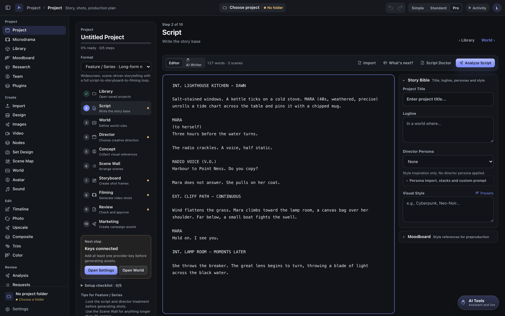
</p>

Most AI video tools are a prompt box behind a paywall. This is a **production
workstation**: a macOS-style desktop app (Electron + React) where the script,
the director treatment, the storyboard, the generated shots, the timeline, the
grade and the export live in one project folder you own. Bring your own keys
for fal.ai, Replicate, Gemini, xAI, ElevenLabs and Runway; route every shot to
the model that is actually best for it; keep everything local.

If it helps you make something, **please star the repo**. Stars are how other
filmmakers and developers find it.

## Why people use it

| | |
| --- | --- |
| **One production loop** | Script → Director pass → Concept & casting → Storyboard → Filming → Review → Edit → Color → Deliver, with a Studio Agent that can run phases for you. |
| **Best model per shot** | Pick a model, or choose **Auto** and let the studio route people to Nano Banana / GPT Image 2, creatures to Krea 2, environments to Seedream 5 Pro, typography to Ideogram, dialogue to Veo 3.1, performance to Kling v3, action and long takes to Seedance 2.5. |
| **Real post tools** | DaVinci-style page bar (Media, Cut, Edit, Fusion, Color, Fairlight, Deliver), colour wheels baked into 3D LUTs, waveform and histogram scopes, offline auto-cut (silence, scenes, filler words). |
| **3D previs** | Turn a reference image into a 3D blockout (Hunyuan3D v3, Trellis 2, Rodin 2.5), keyframe camera moves, render them as motion references for video generation. Scene maps flip into 3D with prefab houses, cameras, lights and characters. |
| **Boards and research** | PureRef/Miro-style infinite moodboard with sticky notes and connectors, a knowledge graph over your research sources, an Apple Photos-style library across projects. |
| **Local and open** | GPL-3.0 core, projects are plain folders, keys stay on your machine. Plugins install straight from GitHub. |

## Tour

<table>
  <tr>
    <td width="50%">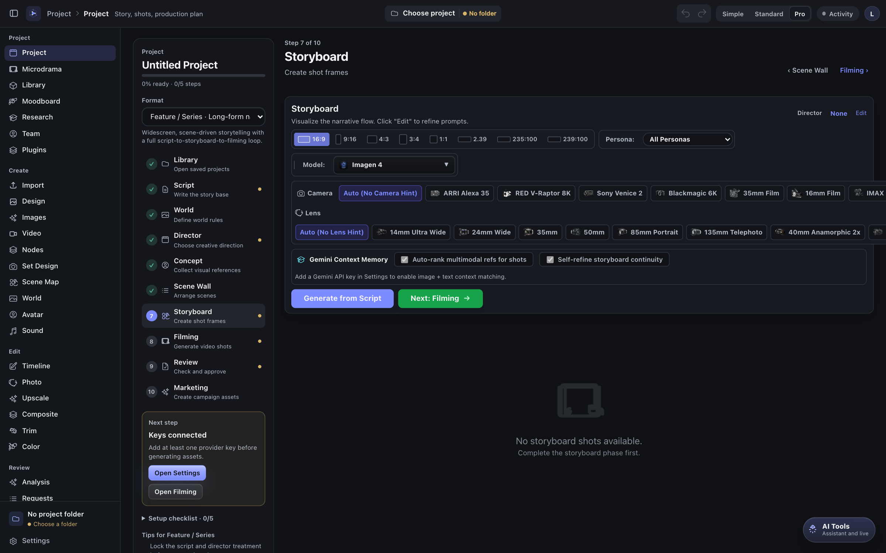<br /><sub><b>Storyboard.</b> Aspect ratio, camera body, lens and director persona per shot; model choice or Auto; Gemini continuity review and self-refine.</sub></td>
    <td width="50%">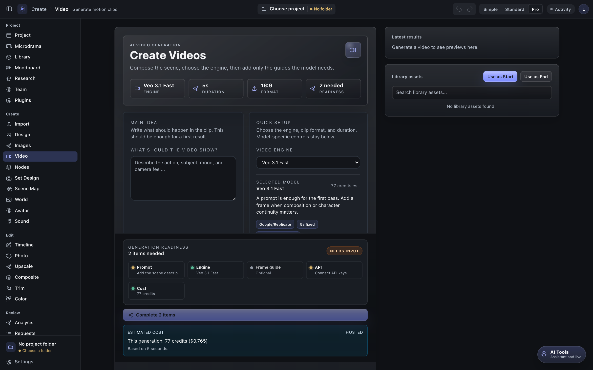<br /><sub><b>Filming.</b> Seedance 2.5, Kling v3 / O3, Veo 3.1, WAN 2.7, LTX 2.3, PixVerse and more, with start/end frames, motion references and synced audio.</sub></td>
  </tr>
  <tr>
    <td>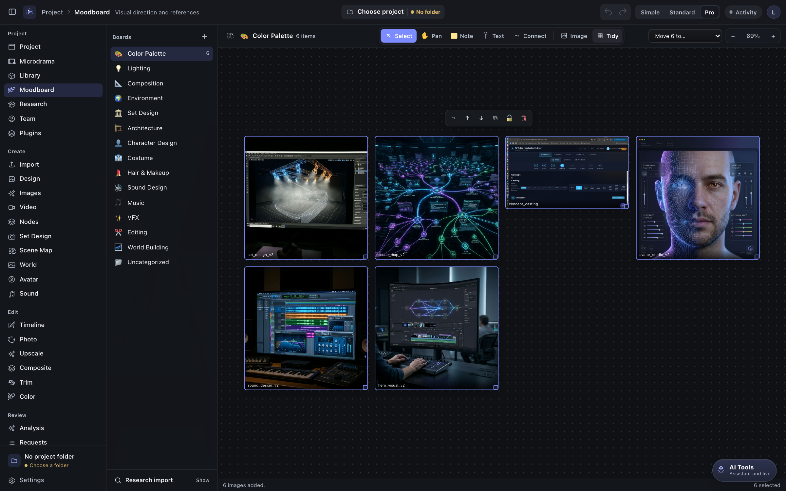<br /><sub><b>Moodboard.</b> Infinite canvas with pan, pinch zoom, sticky notes, text, connectors, drag-and-drop and clipboard paste. Double-click anywhere to add.</sub></td>
    <td>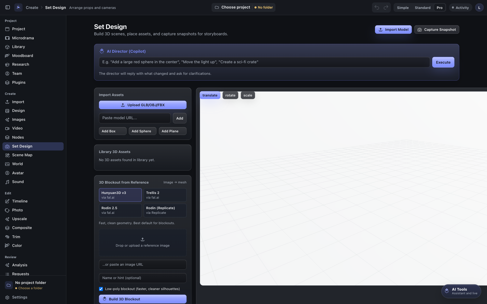<br /><sub><b>Set Design.</b> Reference image → 3D blockout, then keyframed camera moves (push in, orbit, crane) rendered straight into the library.</sub></td>
  </tr>
  <tr>
    <td>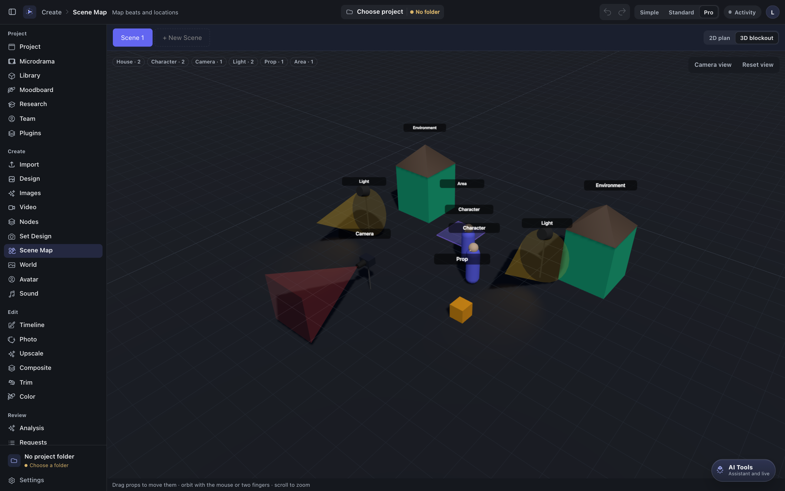<br /><sub><b>Scene Map 3D.</b> The 2D floor plan becomes a blocking set with prefab houses, cameras with frustums, lights, characters and props. Look through any camera.</sub></td>
    <td>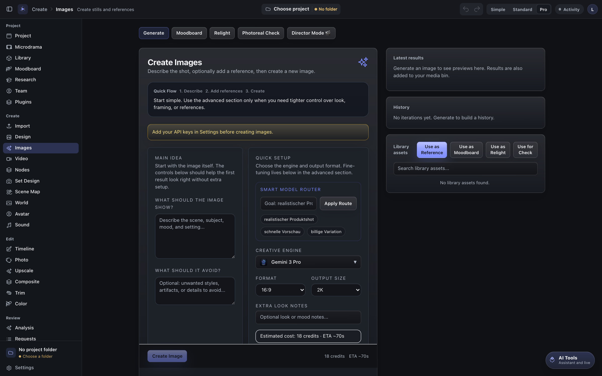<br /><sub><b>Images.</b> Seedream 5.0 Pro, GPT Image 2, Nano Banana 2, Krea 2, Ideogram 4, Flux, Qwen and more, with per-model prompt structuring.</sub></td>
  </tr>
  <tr>
    <td>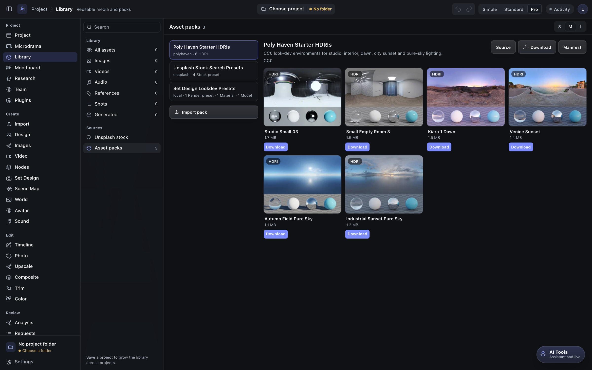<br /><sub><b>Library.</b> Every generated or imported asset across projects, with quick look, inspector, Unsplash stock and asset packs.</sub></td>
    <td>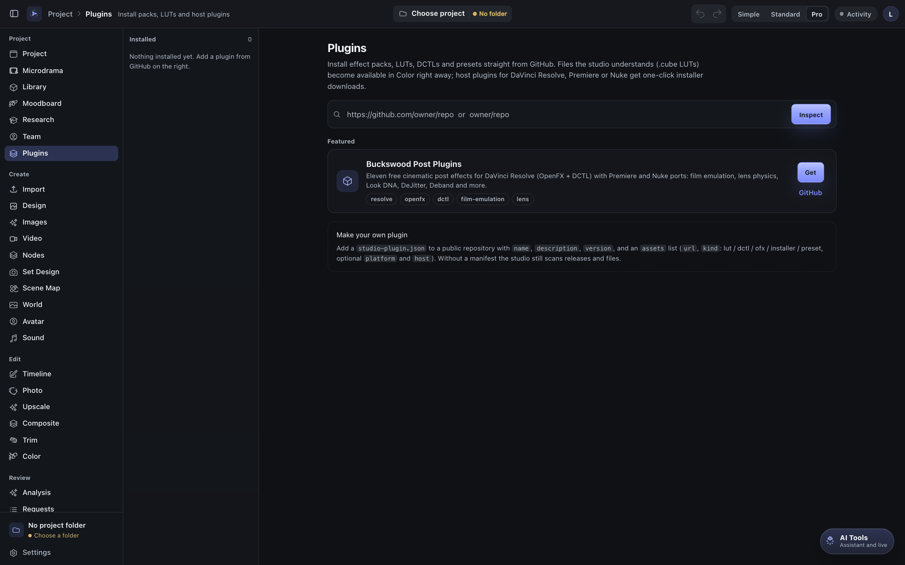<br /><sub><b>Plugins.</b> Install packs from any GitHub repo: LUTs become available in Color, DCTL and OpenFX bundles get one-click installers.</sub></td>
  </tr>
  <tr>
    <td>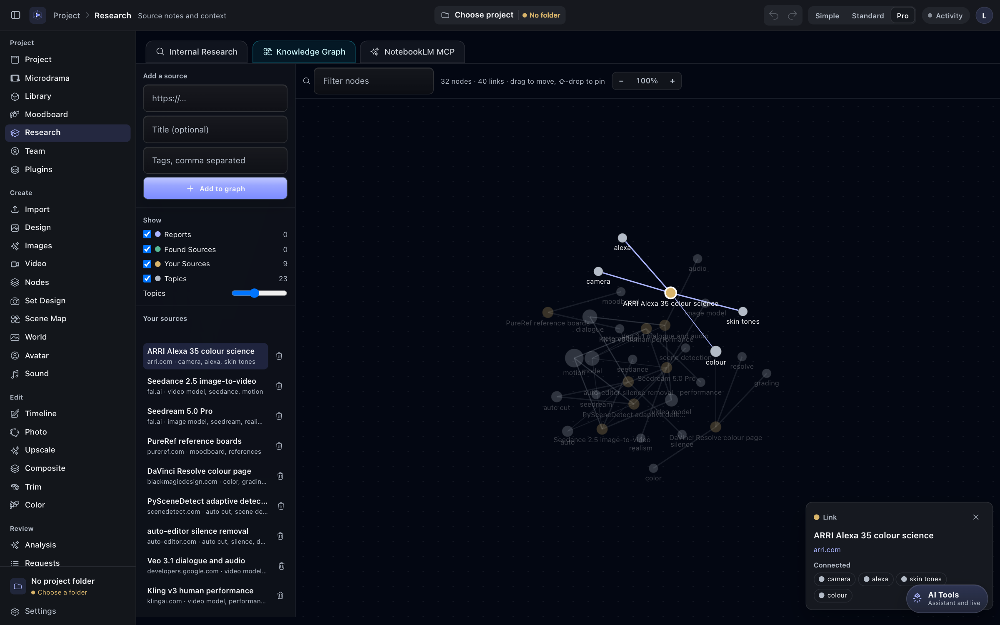<br /><sub><b>Research graph.</b> Reports, sources and shared topics as a force-directed graph. Add your own links and tags.</sub></td>
    <td>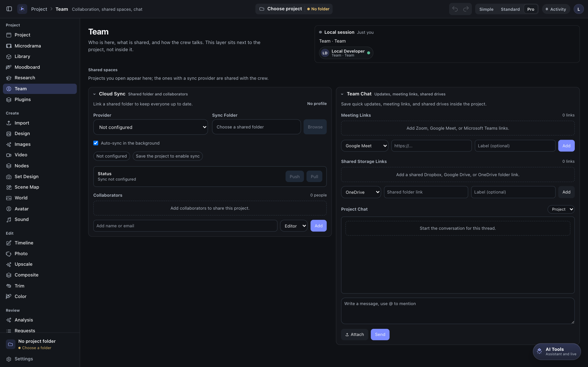<br /><sub><b>Team.</b> Presence, shared spaces, cloud sync, chat and meeting links as a collaboration layer next to the project.</sub></td>
  </tr>
</table>

## 30-second tour

```text
Script -> Director pass -> Concept & casting -> Storyboard -> AI filming
       -> Continuity review -> Re-film queue -> Edit / Color / Sound -> Deliver
```

1. **Choose a format** in the Project hub (feature, short, microdrama 9:16,
   commercial, music video, documentary, social). It sets aspect ratio, look and
   casting defaults for every generator.
2. **Write or generate the script**, run **Analyze Script** to extract
   characters, locations and props.
3. **Director pass** turns the script into a shot list with cinematic
   direction; **Concept** casts characters and environments.
4. **Storyboard** and **Filming** generate frames and clips, with continuity
   checks and a re-film queue.
5. **Edit, Color, Fairlight, Deliver** finish the cut, with the Studio Agent
   able to run the loop for you.

Read the [First 10 minutes](docs/FIRST_10_MINUTES.md), the
[capability map](docs/CAPABILITY_MAP.md), the
[UI production workflow guide](docs/ui-production-workflow-guide.md), and the
[demo project](examples/demo-project/README.md).

## What is new (September 2026)

- macOS-style shell: source-list sidebar, slim toolbar, activity center with
  progress for every running job, dark and light themes.
- Project hub rebuilt: sticky action bars per phase, production formats,
  trimmed Story Bible, a separate Team workspace.
- Auto model choice for images and video based on what the shot shows.
- New engines: Seedance 2.5 (T2V, I2V, Omni), Seedream 5.0 Pro (+Edit), Krea 2,
  Ideogram 4, GPT Image 2; Runway Ruby SDR→HDR; Hunyuan3D v3, Trellis 2, Rodin
  2.5 for image-to-3D.
- Color page with lift/gamma/gain/offset wheels, scopes and `.cube` export;
  DaVinci-style page bar across the post pages.
- Offline auto-cut (adaptive silence removal, scene detection, filler words),
  PureRef/Miro moodboard, knowledge graph, plugin installer, scene map 3D.

## Models and providers

| Task | Engines |
| --- | --- |
| Images | Seedream 5.0 Pro / 4.5, GPT Image 2 / 1.5, Nano Banana 2, Gemini 3 Pro, Imagen 4, Krea 2 Large / Turbo, Ideogram 4, Flux 1.1 Pro / 2, Qwen Image, WAN 2.7, Z-Image, Grok Imagine |
| Video | Seedance 2.5 / 2.0 / 1.5, Veo 3.1, Kling v3 Pro / O3 / 2.6, WAN 2.7 / 2.2, LTX 2.3, PixVerse C1, Happy Horse, Creatify Aurora, Grok Imagine |
| 3D | Hunyuan3D v3, Trellis 2, Rodin 2.5 / Gen-2, World Labs Marble worlds |
| Audio | ElevenLabs, Sonauto, Sonilo, Gemini TTS, local mastering tools |
| Post | Runway Ruby (SDR→HDR), LTX ACES HDR upscale, colour wheels + LUTs, Auto Cut |
| Providers | fal.ai, Replicate, Google Gemini, xAI, ElevenLabs, Runway, LTX, World Labs, Brave Search, Unsplash, Supabase, Stripe |

Bring your own keys; the app stores them locally. Model APIs move quickly, so
adapters are maintained integration points rather than permanent contracts.

## Quick start

**Just want the app?** Download the newest installer from
[GitHub Releases](https://github.com/LudwigKienle/ai-video-production-editor/releases/latest)
(signed macOS `.dmg`, Windows `.exe`), open it, add at least one provider key
in Settings, choose a project folder.

**Developers:**

```bash
npm install
cp .env.example .env.local   # optional overrides
npm run dev                  # browser studio at http://localhost:5173/studio.html
npm run electron:dev         # desktop app against the dev server
npm run build:web            # production web build
npm run electron:build       # distributable desktop packages
```

Requirements: Node.js 20.19+ or 22.12+, npm 10+, Python 3 for the optional local
audio tools. Local project storage, folder pickers and some integrations need
the Electron app; the browser build is for development and previews.

Checks before a release:

```bash
npm test
npm run check:public-release
npm run check:public-release:strict
```

Screenshots in this README are generated with
`node scripts/capture-screenshots.mjs` against the dev server.

## Video tutorials

Official channel: [youtube.com/@AIVideoProductionEditor](https://www.youtube.com/@AIVideoProductionEditor)

- Short product overview for a fast first impression.
- Full Mac walkthrough: keys, script, storyboards, video generation, editing,
  grading, export.
- v1.5 tour: AI Director, Node Graph, Sound tab, 3D set design.
- v2.5 update: Scene Wall and YouTube-oriented workflow tips.

## Project map

| Path | Purpose |
| --- | --- |
| `src/workspaces` | Studio workspaces (Project hub, Moodboard, Set Design, Edit, Color, Library, Plugins, Team, …) |
| `src/components` | Shared UI: shell, sidebar, toolbar, activity center, colour wheels, knowledge graph |
| `src/services` | Provider adapters (fal, Replicate, Gemini, Runway, LTX, …), project storage, plugins, task center |
| `src/utils` | Model auto-selection, prompt guides per model, colour wheels → LUT, offline auto-cut |
| `src/data` | Production formats, moodboard categories, camera/lens/style presets, asset packs |
| `electron` | Desktop shell, preload bridge, local runtime handlers |
| `api`, `server/byok` | Optional hosted billing, usage and BYOK proxy endpoints |
| `docs` | Product, build, pricing and launch documentation |
| `packages/storyboard-embed-sdk` | Embeddable story/project SDK |

## Contributing

Good first areas: model adapters when APIs change, UI polish, one documented
end-to-end workflow, Node Space templates, focused tests around utilities,
translations.

- [Contributor guide](CONTRIBUTING.md) · [Contributor paths](docs/CONTRIBUTOR_PATHS.md) · [Starter tasks](docs/CONTRIBUTOR_STARTER_TASKS.md)
- [Roadmap](ROADMAP.md) · [Open issues](https://github.com/LudwigKienle/ai-video-production-editor/issues) · [`good first issue`](https://github.com/LudwigKienle/ai-video-production-editor/labels/good%20first%20issue) · [`help wanted`](https://github.com/LudwigKienle/ai-video-production-editor/labels/help%20wanted)
- Security: follow [SECURITY.md](SECURITY.md) instead of opening a public issue.

When asking for help, include the workspace, the selected model, the inputs the
UI asked for, the error text, and whether you are on the browser dev build or
the Electron app.

## Releases and desktop builds

Installers are published on GitHub Releases, never committed to the tree.
Pushing a version tag such as `v0.1.0-open-source` runs
`.github/workflows/desktop-release.yml`, which builds a signed and notarized
macOS `.dmg` and a Windows `.exe` and attaches both to the release. Public tag
releases need these GitHub Actions secrets: `MACOS_CERTIFICATE_BASE64`,
`MACOS_CERTIFICATE_PASSWORD`, `APPLE_ID`, `APPLE_APP_SPECIFIC_PASSWORD`,
`APPLE_TEAM_ID`. Encode a certificate with `base64 -i cert.p12 | pbcopy`.

## Configuration and privacy

- Provider keys are entered in the app and stored locally. `.env.local` is for
  development, hosted features and build signing only.
- Never commit `.env`, certificates, private keys, release builds or provider
  credentials; `.env.example` holds placeholder names only.
- Hosted billing and proxy features require your own Supabase and Stripe
  projects. Provider usage is billed by the provider unless you route it through
  your own credit system.

## Open-source model, license and branding

The editor core is GPL-3.0-or-later; see [LICENSE](LICENSE), [NOTICE](NOTICE)
and [AUTHORS.md](AUTHORS.md). Hosted services, managed credits, cloud rendering,
team sync and support can be built around the open core without putting the
local app behind a paywall. The package is marked `private` only to prevent
accidental npm publication.

Forks must keep copyright and license notices and may not present themselves as
the official release; see [TRADEMARK.md](TRADEMARK.md).

Copyright (C) 2026 Ludwig Maximillian Kienle.
