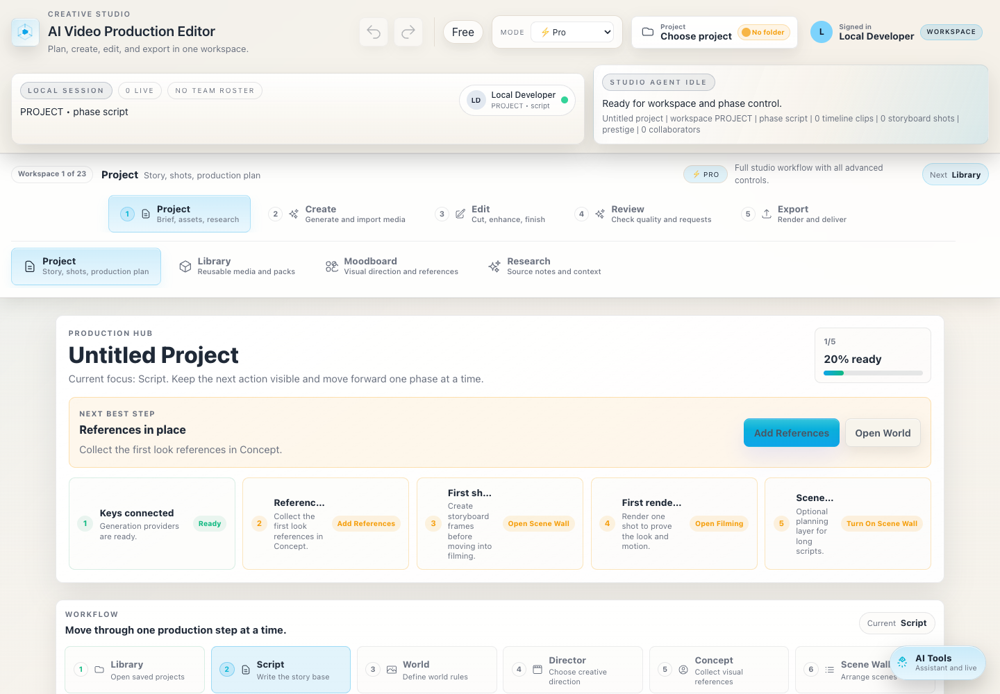
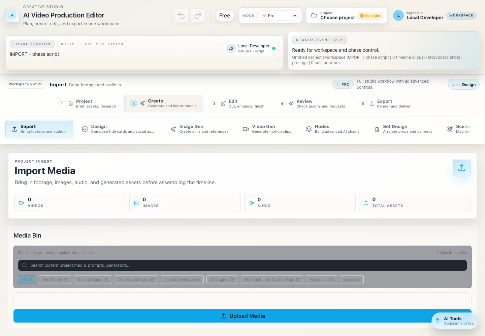
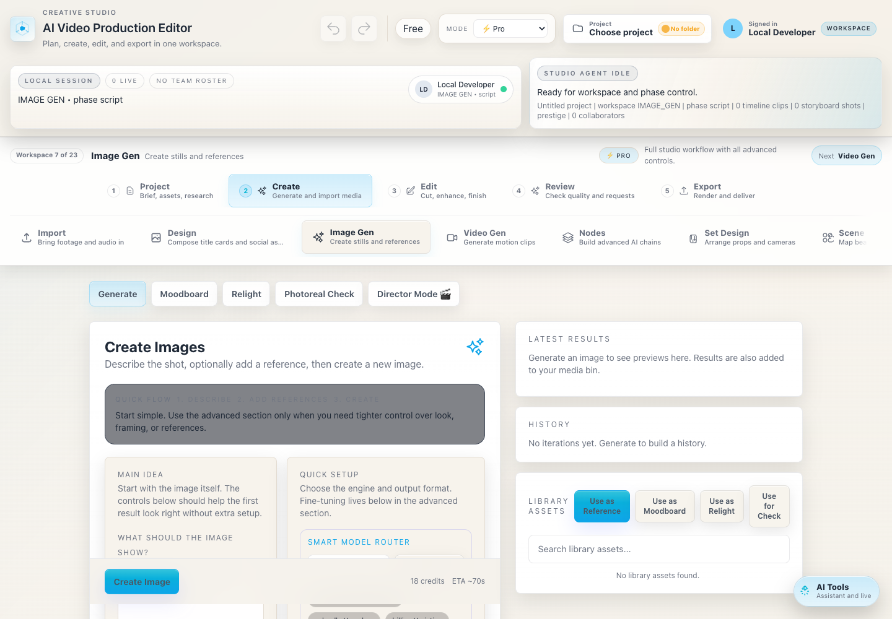
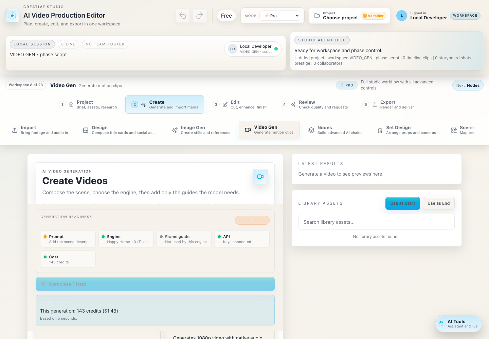
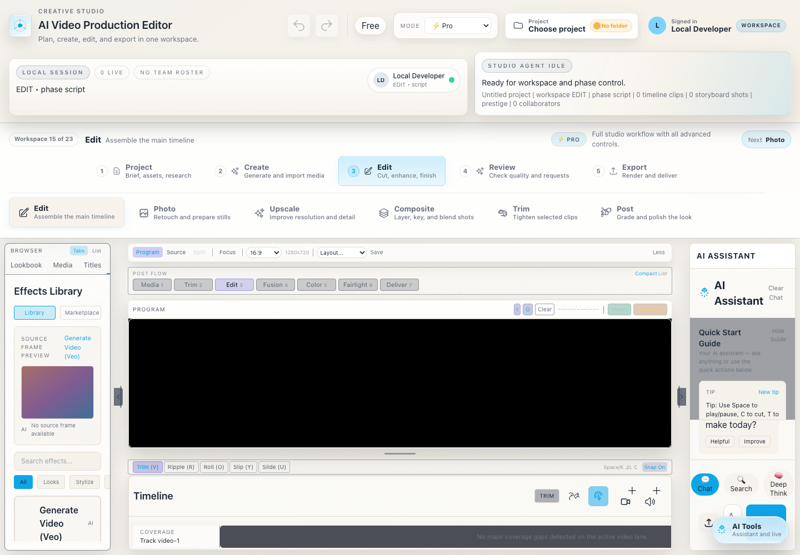
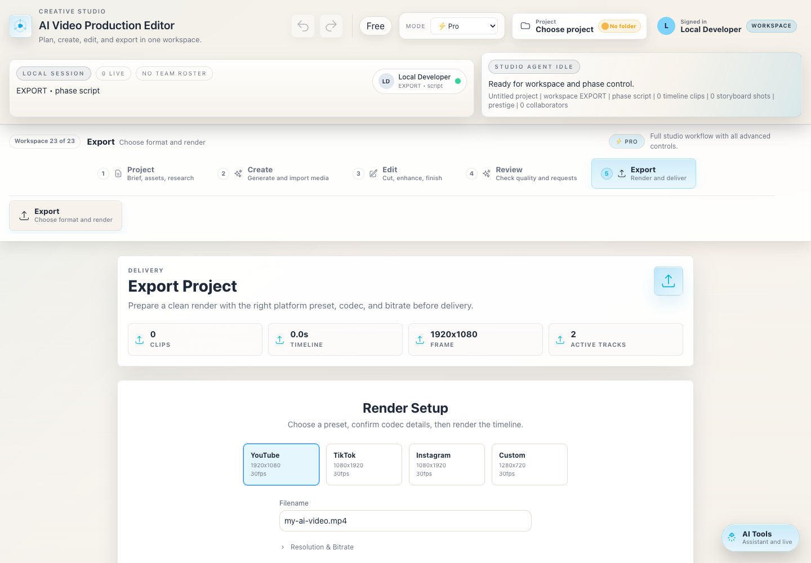

# UI Production Workflow Guide

This guide explains the main studio UI components and the recommended path from a blank script idea to generated shots, edit assembly, and final render.

Screenshots were captured from the local Pro-mode studio. Keep factual UI screenshots unedited so labels, model names, and states stay trustworthy. Use image-generation edits for genre boards, reference stills, concept art, and documentation cover art, not for screenshots that explain exact controls.

## Component Map



### Global Header

The header is the persistent control strip at the top of the studio.

| Area | What it does |
| --- | --- |
| App identity | Shows the current product and keeps the user oriented in the desktop studio. |
| Undo / Redo | Reverts or reapplies supported timeline and project actions. Disabled states are normal before edits exist. |
| Plan badge | Shows the active billing/usage mode. In local BYOK workflows this can remain informational. |
| Mode selector | Switches between Simple, Standard, and Pro. Simple hides advanced workspaces; Pro exposes the full production pipeline. |
| Project menu | Opens or links a local project folder. Use this before a serious project so assets and project JSON stay organized. |
| Account/workspace button | Shows the active local or hosted user context. |

### Presence And Studio Agent Strip

The presence strip shows whether you are in a local session, how many people are live, and which workspace/phase is active. The Studio Agent card summarizes the current app state so automation and support answers can refer to concrete context: project name, workspace, phase, timeline clip count, storyboard shot count, and collaborators.

### Workspace Switcher



The switcher is split into workflow groups and workspace tabs.

| Group | Primary purpose | Typical workspaces |
| --- | --- | --- |
| Project | Planning, story, source context, references | Project, Library, Moodboard, Research |
| Create | Import and generate media | Import, Design, Image Gen, Video Gen, Nodes, Set Design, Scene Map, World Gen, Avatar, Sound |
| Edit | Assemble and improve shots | Edit, Photo, Upscale, Composite, Trim, Post |
| Review | Quality control and change requests | Analysis, Director Review, Requests |
| Export | Delivery setup and render | Export |

Use the `Next` button for linear beginner flow, or jump directly between tabs in Pro mode. For most users, the safest path is still linear: Project -> Create -> Edit -> Review -> Export.

## Workspace Components

### Production Hub

The Production Hub is the project dashboard. It exposes readiness cards, a next-best-step callout, and the internal phase map.

Use it to answer: "What is the next useful action?" If the hub says keys, references, storyboard shots, or first render are missing, solve that before moving deeper into editing.

Recommended phase order:

1. Library: open or create the project.
2. Script: write or import the story base.
3. World: define setting, rules, locations, and recurring constraints.
4. Director: choose creative direction and convert story intent into shots.
5. Concept: lock characters, environments, props, and style references.
6. Scene Wall: arrange larger scripts into scene-level blocks.
7. Storyboard: create shot frames and prompt context.
8. Filming: generate motion clips from ready prompts and frames.
9. Review: check continuity, quality, pacing, and requested fixes.
10. Marketing: derive posters, thumbnails, trailers, or social cuts.

### Image Generation Workspace



Image Gen creates stills and references before filming. The workspace is organized around tabs:

| Tab | Use it for |
| --- | --- |
| Generate | First-pass concept stills, shot frames, environment references, poster ideas. |
| Moodboard | Collect and reuse style references without losing visual direction. |
| Relight | Rework lighting direction while preserving the subject. |
| Photoreal Check | Validate or improve realism before using an image as a start frame. |
| Director Mode | Apply a consistent creative direction to generated visuals. |

For genre changes, do not rewrite the whole project every time. Keep invariant details stable, then change only style variables:

```text
Keep fixed:
- character identity
- environment geography
- camera angle and lens
- prop positions
- continuity-critical wardrobe

Change:
- genre
- lighting
- color palette
- texture/material language
- weather/atmosphere
- film stock or finishing style
```

Example genre prompt pattern:

```text
Create a 16:9 cinematic storyboard frame.
Subject: [character/action].
Continuity lock: preserve [wardrobe, face, prop, environment].
Genre pass: [neo-noir thriller / bright commercial comedy / grounded sci-fi / prestige documentary].
Camera: [shot size, lens, movement hint].
Lighting: [specific lighting direction].
Do not change the core blocking or story beat.
```

Use image-generation edits for creative derivatives such as "make this concept noir", "turn this into a grounded sci-fi production design", or "create a cleaner Apple-like documentation cover". Do not use generated edits for exact UI screenshots that teach controls.

### Video Generation Workspace



Video Gen converts prompts and optional frames into motion clips. The readiness panel is the most important component: it tells you what is missing before the generate button can run.

Key areas:

| Area | What to check |
| --- | --- |
| Main idea | Clear action, subject, mood, camera feel. This is required for most text-to-video passes. |
| Engine | Select the model family: Seedance 2.0, Kling 3.0 / v3 Pro, Happy Horse 1.0, Veo, WAN, LTX, Grok, and other adapters live here. |
| Frame guide | Optional for text-to-video, required for image-to-video models. Use storyboard frames for continuity. |
| API state | Confirms whether the required provider key exists. Seedance 2.0 and Happy Horse require FAL; other engines may require Gemini, Replicate, or xAI. |
| Cost/readiness | Shows estimated credits and missing input states before generation. |
| Library assets | Lets you reuse existing stills as start or end frames. |

Model routing examples:

| Model family | Use when | Required input |
| --- | --- | --- |
| GPT Image | You need high-prompt-adherence stills, text-aware visuals, or polished concept frames before filming. | Prompt, optional references, image provider key depending on route. |
| Nano Banana | You need fast image ideation, photoreal references, or quick concept variations. | Prompt, optional references, Gemini or FAL route depending on selected model. |
| Seedance 2.0 | You want FAL-based image-to-video or reference-to-video motion with strong start-frame control. | Prompt plus start image or references depending on mode, duration, aspect ratio, FAL key. |
| Kling 3.0 / v3 Pro | You want FAL text-to-video or image-to-video with strong cinematic output, end-frame guidance, audio toggle, and advanced prompt controls. | Prompt, optional start/end image depending on mode, duration, aspect ratio, FAL key. |
| Happy Horse 1.0 Text-to-Video | You want native audio-video generation from a written prompt. | Prompt, aspect ratio, duration, FAL key. |
| Happy Horse 1.0 Image-to-Video | You have a storyboard frame or reference still that should become the first frame. | Start image, prompt, aspect ratio, duration, FAL key. |

Prompt template for filming:

```text
Shot [number]: [one-sentence action].
Subject continuity: [character/reference names].
Environment: [location and time of day].
Camera: [shot size, lens, movement].
Motion: [what moves, how fast, emotional pacing].
Genre/look: [style pass].
Avoid: [continuity breaks, extra limbs, text, logo changes, wrong wardrobe].
```

### Edit Workspace



Edit is the assembly surface. It combines media browser, preview/program monitor, assistant panel, effects, trim tools, and the timeline.

| Component | Purpose |
| --- | --- |
| Browser panel | Switches between lookbook, media, effects, titles, transitions, music, and auto-cut tools. |
| Program monitor | Displays the active timeline frame and lets you judge composition before export. |
| Post-flow buttons | Keep a familiar editing mental model: Media, Trim, Edit, Fusion, Color, Fairlight, Deliver. |
| Trim mode row | Switches between normal, ripple, roll, slip, and slide trim behaviors. |
| Timeline | The source of truth for final ordering, audio/video layers, and clip timing. |
| AI Assistant | Good for "what next?" and guided edit operations, but verify the timeline visually. |

Start rough, then refine:

1. Add generated clips or imported footage to the media bin.
2. Place the best shots in order on the timeline.
3. Trim pauses and overlaps.
4. Add titles, transitions, music, and sound effects.
5. Use Post/Color after the sequence timing works.

### Export Workspace



Export turns the timeline into a deliverable file. Choose the target platform first, then adjust technical settings.

| Preset | Best for |
| --- | --- |
| YouTube | Standard 16:9 delivery and longer uploads. |
| TikTok | Vertical 9:16 delivery. |
| Instagram | Reels-style vertical delivery. |
| Custom | Client specs, tests, or unusual aspect ratios. |

Before rendering, check:

1. Timeline is not empty.
2. Active tracks are unmuted and unlocked.
3. Resolution and fps match the destination.
4. Filename is clear and versioned.
5. Codec/container matches the target platform or client requirement.

## End-to-End: Script To Filming To Render

Use this exact routine for a clean first project.

### 1. Prepare The Project

Open the app, complete onboarding, choose `Pro` when you need the full pipeline, and connect provider keys in Settings. For a local desktop project, choose a project folder early so generated assets can be collected and reused.

Minimum keys by workflow:

| Need | Provider key |
| --- | --- |
| Script help, analysis, Imagen/Veo/Gemini workflows | Gemini |
| Happy Horse, Seedance 2.0, Kling 3.0 / v3 Pro, FAL video/image models | FAL |
| GPT Image and Nano Banana routes | OpenAI/Gemini/FAL route depending on selected adapter |
| Flux, Kling, LTX, upscalers, Replicate-hosted models | Replicate |
| Grok image/video | xAI |
| Voiceover | ElevenLabs |
| Music | Sonauto |

### 2. Write Or Import The Script

In Project -> Script:

1. Fill project title and logline.
2. Paste or import the script.
3. Use AI Writer or Script Doctor only after the core intent is clear.
4. Analyze the script to extract characters, environments, props, and shot opportunities.

Do not start filming before the concept references exist. AI video quality drops when the model has to invent every recurring detail shot by shot.

### 3. Lock The Look

In Concept, Moodboard, and Image Gen:

1. Generate or import reference images for main characters, locations, props, and brand/product details.
2. Run genre passes as separate versions: keep identity fixed, change style/lighting.
3. Pick one approved style direction before batch storyboarding.
4. Store chosen stills as library assets or references.

For genre exploration, create three to five variants rather than one giant prompt. Example passes:

| Genre pass | Prompt addition |
| --- | --- |
| Neo-noir | Low-key lighting, wet street reflections, restrained cyan/amber practicals, tense framing. |
| Prestige commercial | Clean product lighting, controlled highlights, premium materials, crisp readable composition. |
| Grounded sci-fi | Functional industrial design, plausible interfaces, cool atmosphere, no fantasy glow overload. |
| Documentary | Natural light, handheld realism, imperfect human texture, restrained color. |

### 4. Build Storyboard Frames

In Storyboard:

1. Generate shots from the script or director treatment.
2. Check every shot prompt for subject, action, camera, and continuity.
3. Generate storyboard images.
4. Promote approved frames to filming start frames.

For difficult continuity shots, use Image-to-Video instead of Text-to-Video. A good start frame usually matters more than a longer prompt.

### 5. Film The Shots

In Video Gen or Project -> Filming:

1. Select a model.
2. Use GPT Image or Nano Banana for stills, references, and storyboard frame iteration.
3. Use Seedance 2.0 when a start frame or reference-driven motion pass should control the clip.
4. Use Kling 3.0 / v3 Pro when you need high-quality FAL T2V/I2V shots with advanced prompt, audio, and end-frame controls.
5. Use Happy Horse Text-to-Video when prompt-only native audio-video generation is enough.
6. Use Happy Horse Image-to-Video when a storyboard frame should anchor the shot.
7. Keep duration short for first passes.
8. Generate one proof shot before batch rendering a whole scene.
9. Save good takes to the media bin or project library.

If readiness says input is missing, solve the exact missing item first. Do not keep pressing Generate.

### 6. Assemble The Timeline

In Edit:

1. Add approved clips to the timeline in story order.
2. Trim for pacing.
3. Add voice, music, and sound effects.
4. Use transitions only where they support the cut.
5. Run review/analysis after a complete rough cut exists.

### 7. Review And Fix

In Review and Requests:

1. Watch the full sequence.
2. Mark continuity, audio, motion, and pacing issues.
3. Convert notes into requests.
4. Re-film only affected shots.
5. Replace timeline clips, then review again.

### 8. Render

In Export:

1. Choose the platform preset.
2. Confirm resolution, fps, codec, bitrate, and filename.
3. Render a short test if the project is long.
4. Render the final file.
5. Create marketing derivatives only after the final look is approved.

## Contributor Notes For Future Docs Screenshots

1. Use Playwright or another deterministic browser capture tool for UI screenshots.
2. Store documentation screenshots under `docs/assets/ui-guide/`.
3. Avoid screenshots that show real API key prefixes, local usernames beyond test accounts, client names, or private media.
4. Keep screenshots factual. Do not AI-edit controls, model names, prices, warning states, or labels.
5. Use image generation for supporting visual assets only: cover art, genre boards, neutral mock project media, and before/after creative examples.
6. Re-run `npm run check:public-release` before publishing screenshots.
